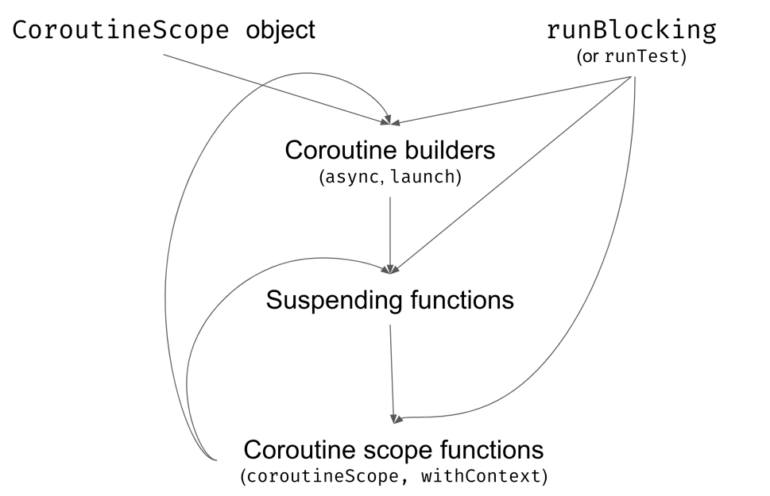

# Coroutines examples
## Basic coroutine - raw one
Not recommended to use unless you are creating your custom libraries and want to avoid dependencies to kotlinx.coroutines

Suspend function:
- is getting additional parameter - continuation
- changing return type - If function is suspending it return COROUTINE_SUSPENDED key
- for each suspend function we have anonymous impl for continuation
  - continuation holds state (variables and labels each suspend func)
  - holds place where we should return
  - is responsible to re-trigger suspended function
- similar to callbacks but without callbacks
  
    
 


##  kotlinx.coroutines

### coroutine builders
- launch - starts new coroutine - will be run independently. require parent coroutine (CoroutineScope)
- runBlocking - starts new coroutine but blocks thread. Should be not used too much - Recommended uses:
  - blocking main thread
  - test
- async - similar to launch - but designed to calculate values. Recommended usage:
  - calculate value parallel 
  
### Structured concurrency
Each coroutine builders is extension function on CoroutineScope. Because of that starting new coroutine we have to be in some scope.
This is how we are creating coroutine tree.
What it is giving to us? 
- children inherit context of parent
- parent waits for all child finish
- when parent is canceled all children are canceled
- when child throws exception, parent and other children of parent are destroyed

### coroutineScope
When you are in suspending function and you want to create new coroutine
you are not allowed since you dont have CoroutineScope.

To solve it you can have to call suspending function coroutineScope to create new scope




### coroutine context
CoroutineContext is an interface that represents an element or a collection
of elements. So CoroutineContext is just a way to hold and pass data. By default,
the parent passes its context to the child, which is one of the parentchild
relationship effects. We say that the child inherits context from
its parent. 
``` defaultContext + parentContext + childContext ```


### Jobs 
Conceptually, a job represents a cancellable thing with a lifecycle.
Formally, Job is an interface, but it has a concrete contract and state,
so it might be treated similarly to an abstract class.
A job lifecycle is represented by its state. Here is a graph of states and
the transitions between them


### Cancellations
A very important functionality of Kotlin Coroutines is cancellation.

The Job interface has a cancel method, which allows its cancellation.
Calling it triggers the following effects:
• Such a coroutine ends the job at the first suspension point
(delay in the example below).
• If a job has some children, they are also cancelled (but its
parent is not affected).
• Once a job is cancelled, it cannot be used as a parent for any
new coroutines. It is first in the “Cancelling” and then in the
“Cancelled” state.

cancelAndJoin


### Exception handling


### Dispatchers

## Channels and Flows


Questions?:

when coroutines can switch thread??
when createing coroutineScope - from where it gets parent??
