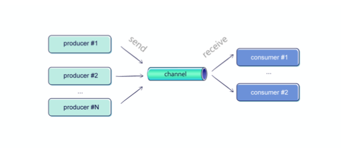

# Intro

what we will discuss:
- basic of coroutines and some understanding how then are working underthehood
- introduction to kotlinx.coroutines
  - common components
- examples where we could use it
  - etl
  - spring


What we should leave that for other meetings:
- non blocking libraries 
- performance comparisons
- spring configuration and optimization -  especially web-flux  

# Coroutines examples

- instance of suspendable computation
- conceptually similar to a thread - when it comes to computation
- is not bound to any particular thread

## Basic coroutine - raw one

Suspend function:
- is getting additional parameter - continuation
- changing return type - If function is suspending it return COROUTINE_SUSPENDED key
- for each suspend function we have anonymous impl for continuation
  - continuation holds state (variables and labels each suspend func)
  - holds place where we should return
  - is responsible to re-trigger suspended function
- similar to callbacks but without callbacks


- Raw coroutines should be used only in 

##  kotlinx.coroutines

### coroutine builders
- launch - starts new coroutine - will be run independently. require parent coroutine (CoroutineScope)
- runBlocking - starts new coroutine but blocks thread. Should be not used too much - Recommended uses:
  - blocking main thread
  - test
- async - similar to launch - but designed to calculate values. Recommended usage:
  - calculate value parallel

### Structured concurrency
- each coroutine has some parent
- it builds coroutine tree

What it is giving to us?
- children inherit context of parent
- when parent is canceled all children are canceled
- when child throws exception, parent and other children of parent can be destroyed

### coroutineScope

- coroutineScope is a suspending function that starts a scope
- returns value from function
- it creates new coroutine but suspends previouse one
- inherits a context from its parent (but overriding Job)
- awaits for all children before it can finish itself,
- cancels all its children, when the parent is cancelled.


### coroutine context

- CoroutineContext is an interface that represents an element or a collection
   of elements
- conceptually similar to map
- each context element has its own Name, in context there can be only one element with same name
- child is inhreting context form  its parent ``` defaultContext + parentContext + childContext ```


### Jobs
 
- #coroutineContext
- each coroutine scope has its own Job
- Conceptually, a job represents a cancellable thing with a lifecycle.
- Here is a graph of states and the transitions between them:


### Cancellations

Cancelation on coroutine or Job:
- Such a coroutine ends the job at the first suspension point (delay in the examples)
- If a job has some children, they are also cancelled (but its parent is not affected)
- Once a job is cancelled, it cannot be used as a parent for any new coroutines. It is first in the “Cancelling” and then in the “Cancelled” state.


### Exception handling

- #coroutineContext
- you can define in context exception handler

### Dispatchers

- pools of threads where coroutines will be executed. Predefined:
  - Default - default one - designed to run CPU - intensive operations. #numberOfCores
  - Main - Android/Swing/otherUI - for example in Android there is only one thread that interacts with ui
  - IO - designed to used when we block thread with IO operations - ie blocking http calls. #max(64, numberOfCores)
  - Unconfined - This dispatcher is different from the previous one, as it is not changing a thread at all. 
- Dispatchers.Default and Dispatchers.IO share the same pool of threads - (optimisation)
- we can create own dispatchers


## Channels
 
The typical cases where we use channels is when on one side values are produced, and on the other, we want to process them.
- multiple producers
- multiple consumers
- tries to dispatch equally

types:
- Rendezvous (default) - channel with capacity 0 or Channel.RENDEZVOUS (that is equal to 0), meaning that exchange can happen only if sender and receiver meet. This means that always one of them will be suspended at least for a moment when waiting for another.
- Buffered - channel with concrete capacity size or Channel.BUFFERED (that is 64 by default, and can be overridden by setting the system property kotlinx.coroutines.channels.defaultBuffer on JVM).
- Unlimited - channel with capacity Channel.UNLIMITED, that has unlimited capacity buffer, and send never suspends.
- Conflated - channel with capacity Channel.CONFLATED, with a buffer of size 1 where each new element replaces the previous one.


- useful when different coroutines need to communicate with each other
- guarantee no conflicts (i.e. no problem with shared state) and fairness.

## Flows

It represents a stream of values that are being asynchronously computed, that supports coroutines (unlike sequences).
There are quite a few use cases where Flow is useful


The most typical usages of the Flow include:
- Receiving messages, that are communicated through Server- Sent Events, WebSockets, notifications, etc.
- Observing user actions,like text changes or clicks.
- Receiving updates from sensors or other information about device, like its localization or orientation.
- Observing changes on databases.
